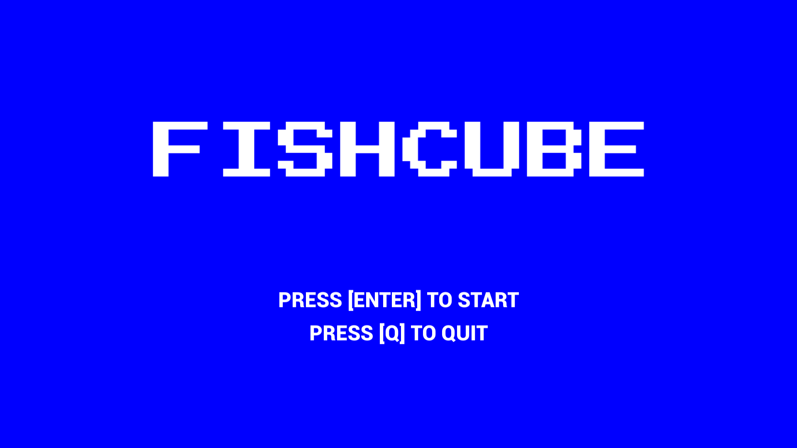
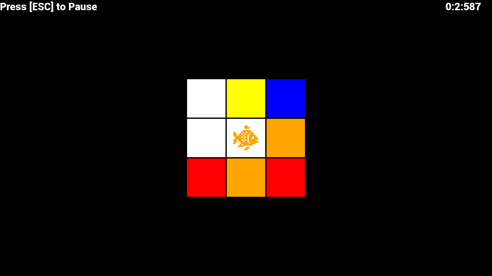

# FishCube
A remake of the 1983 Atari game 'Atari Video Cube' made in C++ using SFML 3.0.2

# Inspiration
The Atari Video Cube is a puzzle video game designed in 1983 for the Atari 2600 console. The idea of the game is that you control a character that traverses a cube, moving pieces around until the cube is solved. The catch is that the character cannot step on pieces of a certain color, if the piece he's holding is of the same color (So if the character is holding a red block, all red pieces on the cube become obstacles). This project implements the classic experience using a more modern framework.

# Requirements
To build this project yourself, you need the following:
* SFML (version 3.0.2)
* CMake (version 4.2.1)
* GCC (version 14.2.0)

# Build
Here's how to build the project:

1. Clone this repo to your machine
```
git clone "https://github.com/Shaj2311/FishCube.git"
```

2. Open CMakeLists.txt and replace this line:
```
set(SFML_DIR "Path/To/SFML-3.0.2/lib/cmake/SFML")
```
with the path to your SFML cmake directory

3. Build using CMake
```
cd ./FishCube
cmake -S . -B build
cmake --build ./build
```

4. Run the built executable
```
./build/FishCube.exe
```

# Screenshots and Recordings



